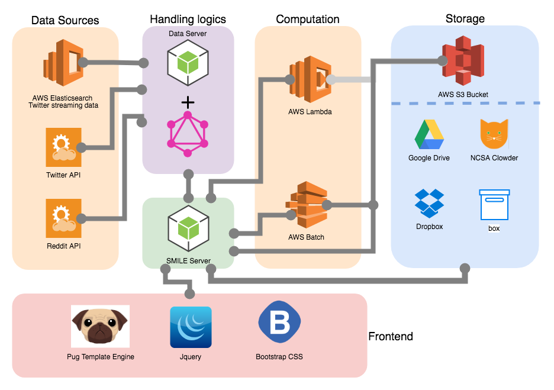

[](https://opensource.org/licenses/Apache-2.0) 

## SMILE (Social Media Intelligence and Learning Environment)


### For users or potential users:
- Watch the **[Overview video](https://www.youtube.com/watch?v=ySb-8TwJ0Ds)**
- Contact us the **[SRTI lab](https://srtilab.techservices.illinois.edu/about/)** if you have any question: <a href="mailto:srti-lab@illinois.edu">srti-lab@illinois.edu</a>
- [SMILE Playground](https://smm-tester.ncsa.illinois.edu) coming soon...

### For developers:
#### Structure of SMILE:


#### Prerequisite:
- You have **Nodejs** installed: https://nodejs.org/en/download
   * In the ```www/``` directory of SMILE, install required libraries ```npm install```
   * In the ```www/graphql/``` directory of SMILE, install required libraries ```npm install```
- Place the ```main_config.json``` file under the path ```www/``` and place the ```graphql_config.json``` file under path ```www/graphql/```
   * These two files contain credentials to acess **AWS**, **Box**, **Dropbox**, **Google drive**, **Reddit**, and **Twitter**
   * The content of ```main_config.json``` looks like this:
   >{
      "box":{
        "client_id": "#####################",
        "client_secret":"#####################"
      },
      "dropbox":{
        "client_id": "#####################",
        "client_secret":"#####################"
      },
      "google":{
        "client_id":"#####################",
        "client_secret":"#####################"
      },
      "reddit":{
        "client_id":"#####################",
        "client_secret":"#####################"
      },
      "twitter":{
        "client_id":"#####################",
        "client_secret":"#####################"
      },
      "aws":{
        "access_key":"#####################",
        "access_key_secret":"#####################"
      }
    }
   * The content of ```graphql_config.json``` looks like this:
   >{
      "twitter":{
        "client_id":"#####################",
        "client_secret":"#####################"
      }
    }

   * You have to set up **AWS** access to AWS lambda, Batch, S3 bucket, Elasticsearch, and EC2.

#### Configuration:
- Clone this repository to your local disk, ```git clone https://cwang138@opensource.ncsa.illinois.edu/bitbucket/scm/smm/smm-smile.git SMILE```. 
- Install **concurently** library ```npm install concurently -g```
   * Concurrent library is used to run SMILE sever and GraphQL server at the same time. To avoid confusion, just isntall
concurrently library globally with a ```-g```.
- Test the **analytics server** ```cd SMILE/www && npm test```
- Test the **GraphQl data server** ```cd SMILE/www/graphql && npm test```
- **RUN** concurrently ```cd SMILE/www && npm start```. The analytic tools run on http://localhost:8001, and the GraphQL data server runs on http://localhost:5050/graphql

#### Computation:
- The business logic is handled by this repository, while the computation part is deployed on AWS Lambda,
 and AWS Batch for long running process. 
You can find the deployed python code in [smm-analytics repository](https://opensource.ncsa.illinois.edu/bitbucket/projects/SMM/repos/smm-analytics/browse)
   * **lambda_classification_predict/** , **lambda_classification_split/**, and **lambda_classification_train/** contains 
   the text classification algorithms which are deployed on AWS Lambda. For larger datasets, we run the same algorithms on AWS Batch, which 
   you can find the corresponding scripts in **batch/batch_classification_predict.py**, **batch/batch_classification_split.py**, and 
   **batch/batch_classification_train.py**
   * **lambda_preprocessing/** and **batch/batch_preprocessing.py** contains the text pre-processing scripts
   * **lambda_sentiment_analysis/** and **batch/batch_sentiment_analysis.py** contains the sentiment analysis scripts
   * **lambda_network_analysis/**, and **batch/batch_network_analysis.py** contains the network analysis scripts
   * **batch/RedditComment.py** expands the top level Reddit submission and comments given a collection of threads
   * **lambda_histogram/** plot a histogram given the search results of social media
   
Please contact the **[SRTI lab](https://srtilab.techservices.illinois.edu/about/)** to request assistance on setting up the SMILE server.
