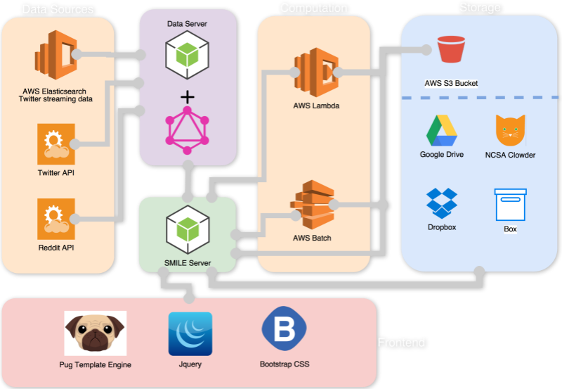
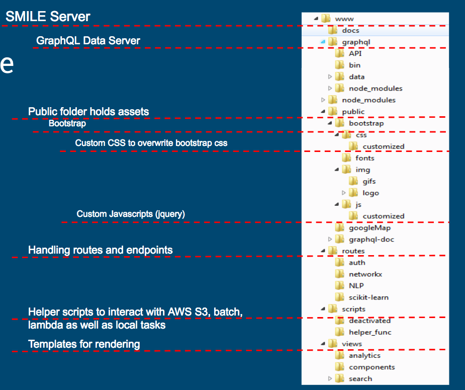

[](https://opensource.org/licenses/Apache-2.0) 

## SMILE (Social Media Intelligence and Learning Environment)

### For users or potential users:
- Go to [socialmediamacroscope.org](https://socialmediamacroscope.org) and request for an account
- If you want to access Clowder within SMILE, you have to also set up a [Clowder account](https://socialmediamacroscope.ncsa.illinois.edu/clowder/signup)
- [Unofficial demo](https://drive.google.com/file/d/1A4RVoNnciGluaW8OS8VLaAsozKkdCfIC/view?usp=sharing)
- Contact us if you have any question: TechServicesAnalytics@mx.uillinois.edu

### For developers:
#### Structure of SMILE:




#### Prerequisite:
- **Nodejs** installed: https://nodejs.org/en/download/
- Place ```main_config.json``` file under the path ```/www/``` and place ```graphql_config.json``` file under path ```/www/graphql```
   * These two files contain credentials to acess **AWS**, **Box**, **Dropbox**, **Google drive**, **Reddit**, and **Twitter**
   * **AWS** access to the current establishments:
       * lambda
       * batch
       * s3
       * elasticsearch
       * ec2
- contact TechServicesAnalytics@mx.uillinois.edu to request configuration files

#### Configuration:
1. ```git clone ``` this repository to your local disk, ```cd www ```. 
2. Install nodejs dependency libraries in the SMILE server and GraphQL server:

```npm install && cd grpahql && npm install```

3. Install **concurently** library

```npm install concurently -g```
Concurrent library is used to run SMILE sever and GraphQL server at the same time. To avoid confusion, just isntall
concurrently library globally with a ```-g```.

4. **TEST** the analytics server

```npm test```;

5. **TEST** the graphql server

```cd graphql && npm test```

6. **RUN** concurrently

```npm start``` in the ```www``` folder

#### Port:
1. Analytic tools run on ```http://localhost:8001```
2. GraphQL data server runs on ```http://localhost:5050/graphql```

:e-mail: email the developer: **cwang138@illinois.edu**
